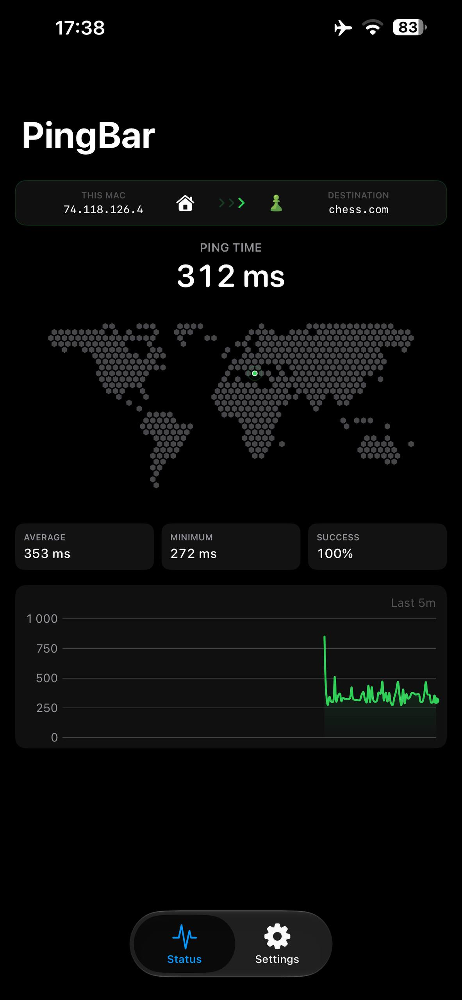
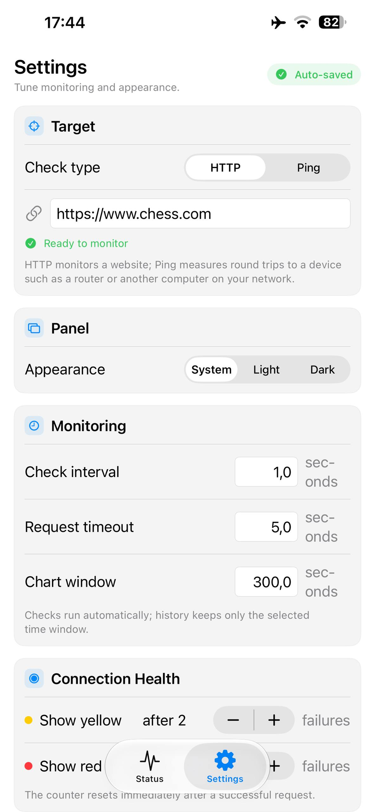

# PingBar

<div style="text-align:center" align="center">
    
</div>

A lightweight, native macOS menu-bar monitor for HTTP availability and latency, with a companion iPhone app. PingBar checks an endpoint on a schedule, keeps recent response history, and shows current health without taking space in the Dock.

## Interface

| Status dashboard | Settings |
| --- | --- |
|  |  |

The status dashboard keeps current health, latency, and recent history in one compact view. Settings uses the same panel footprint and scrolls independently, so switching pages does not move or resize the panel.

### iPhone

| Status dashboard | Settings |
| --- | --- |
|  |  |

The iPhone app shows the same dashboard and settings in a phone-sized layout, with the ping time centered above a larger public-IP map. Menu-bar and panel-window options are hidden there, since they have no iOS equivalent.

## Features

- Monitor an HTTP or HTTPS endpoint, or ping a device on your local network (router, NAS, another computer) by IP address or hostname.
- Configurable endpoint, interval, and timeout.
- Green, yellow, and red availability states with configurable failure thresholds.
- Current, average, and minimum latency with recent success rate.
- Current public IP address with a compact location map: a dotted world grid in the menu bar, and a bolder honeycomb on iPhone.
- Live chart with green success segments and red failure markers.
- Menu-bar display modes: circle, circle and time, or time.
- Compact, fixed-width latency values that keep the menu-bar item stable.
- Configurable menu-bar text size, circle size, HTTP success range, and chart window.
- Movable status and settings panel with a shared compact footprint.
- System, light, and dark appearances with optional macOS transparency.
- Panel position persists across checks, failures, network changes, and app launches — it never resets automatically.
- **Always on Top** keeps the panel visible above all other windows — it stays open until the feature is turned off.
- Settings stored locally in `UserDefaults`.
- A companion iPhone app that runs the same monitoring engine with a phone-sized dashboard, including a larger public-IP map.

## Requirements

- macOS 14 or newer, or iOS 17 or newer
- Xcode 26.6 with Swift 6 when building from source

## Install on macOS

### Homebrew

```sh
brew install --cask melonask/pingbar/pingbar
```

Homebrew adds the tap automatically, so no separate `brew tap` step is needed. Update with `brew upgrade --cask pingbar`, and remove it with `brew uninstall --cask pingbar`.

### Manual download

1. Download `PingBar.zip` from the latest [GitHub Release](../../releases/latest).
2. Unzip it and move `PingBar.app` to `/Applications`.
3. Open PingBar. No build tools are required.

Releases are currently ad-hoc signed rather than notarized, so the first launch may require the steps below.

### macOS cannot verify the app

PingBar is currently ad-hoc signed rather than notarized by Apple, so macOS may show:

> Apple could not verify “PingBar.app” is free of malware that may harm your Mac or compromise your privacy.

Only continue if you downloaded PingBar from this repository's GitHub Releases page.

1. Move `PingBar.app` to the Applications folder.
2. Control-click or right-click `PingBar.app` and choose **Open**.
3. Click **Open** in the confirmation dialog.

If **Open** is not available, try launching the app once, then open **System Settings → Privacy & Security**, scroll to the Security section, and click **Open Anyway** next to the PingBar message.

<details>
<summary>Open Anyway in macOS Privacy and Security settings</summary>


</details>

As a final option for a trusted download, remove only PingBar's quarantine attribute in Terminal. The absolute path matters: a Homebrew-installed `xattr` can shadow the system tool, and if it was built against a Python that Homebrew has since replaced it fails with `bad interpreter`:

```sh
/usr/bin/xattr -dr com.apple.quarantine /Applications/PingBar.app
open /Applications/PingBar.app
```

## Install on iPhone

PingBar for iPhone is built from source and installed over a cable, because it uses a personal development certificate rather than a distributed App Store build.

1. Connect the iPhone to the Mac and trust the computer when prompted.
2. Confirm the device is visible:

   ```sh
   xcrun devicectl list devices
   ```

3. Build, install, and launch with the device name shown by that command (defaults to `partyPhone`):

   ```sh
   ./scripts/run-ios.sh partyPhone
   ```

The first build registers the app's bundle identifier with your Apple developer team and creates a provisioning profile automatically, so Xcode may ask you to sign in under **Settings → Accounts** if you have not used this Mac for iOS development before.

On the iPhone itself, the first launch may be blocked until you trust the developer: open **Settings → General → VPN & Device Management** and trust the entry for your Apple ID.

Two limitations follow from using a personal team:

- The app stops launching after 7 days and must be reinstalled with `./scripts/run-ios.sh`.
- The provisioning profile is tied to the devices registered to your Apple ID, so a new iPhone needs its own build run.

The iPhone app shows the same Status dashboard and Settings as the macOS version. Menu-bar presentation, panel transparency, always-on-top, and panel drag position are macOS-only, so they are hidden on iOS, and the app displays as a normal full-screen app instead of a menu-bar extra.

## Use PingBar

Click the PingBar item in the macOS menu bar to view current latency, recent statistics, availability history, and the last check time.

- PingBar checks automatically and resumes as soon as connectivity returns.
- Click the **pin** button in the top-right header to keep the panel visible above all other windows while you work elsewhere.
- Click the **gear** button in the header to open Settings; click it again or press **Command–Comma** to return to Status.
- Click the **power** button in the top-left header to quit PingBar.
- Drag the strip at the top of either page — or any empty area of the panel — to move it. The strip shows the current display and x/y position while you drag. The position is saved per display, so the panel reopens where you left it even after rearranging screens.
- Enable **Always on top** under **Panel** in Settings — or click the header pin button — to keep the panel visible above all other windows. While it is on, the panel cannot be dismissed: it stays even when you click elsewhere or the network status changes. Turn **Always on top** off to close it normally.
- Use **Circle**, **Circle + Time**, or **Time** to control the menu-bar display.
- Choose **System**, **Light**, or **Dark** under **Panel** and optionally disable the transparent background.

Menu-bar latency is rounded and kept to six monospaced characters so its reserved width does not change. Milliseconds appear as values such as `024 ms`; latencies of one second or more appear as values such as `1.24 s` or `12.3 s`.

### Status colors

| Color | Meaning |
| --- | --- |
| Green | The endpoint is healthy, or has not yet reached the warning threshold. |
| Yellow | Consecutive failures reached the configured warning threshold. |
| Red | Consecutive failures reached the configured failure threshold. |

A successful request resets the consecutive-failure counter. Responses outside the configured inclusive HTTP status range count as failures. When the target is a **Ping** device, latency is measured with ICMP round trips and the HTTP status range does not apply.

### Settings behavior

Changes are saved automatically. Target type and address, interval, timeout, status thresholds, HTTP success range, chart history, public-IP refresh, menu-bar presentation, panel appearance, and always-on-top persist across launches. **Restore Defaults…** asks for confirmation before resetting all options.

PingBar refreshes its approximate public-IP location using `ipwho.is`, with `ipinfo.io` as a fallback. The interval is configurable under **Monitoring → Recheck public IP** and defaults to 15 minutes; one minute is the shortest option. Changing it applies immediately rather than after the current interval elapses. The lookup is used only for the IP badge and micro-map and is not stored by PingBar.

## Develop

### Project layout

PingBar is one Swift package with two targets shared by both apps:

- `Sources/PingBarKit` — the monitoring engine and every shared SwiftUI view. Builds for macOS and iOS.
- `Sources/PingBar` — the macOS menu-bar app (`MenuBarExtra`, panel window behavior).
- `ios/PingBarIOS.xcodeproj` — the iPhone app, which links the local `PingBarKit` product.

ICMP works differently per platform: macOS runs the system `/sbin/ping`, while iOS measures round trips with an unprivileged ICMP datagram socket because it cannot spawn processes.

### Build the macOS app

```sh
./scripts/build-app.sh
open PingBar.app
```

This creates an ad-hoc signed `PingBar.app` in the project directory.

The app icon is generated from `logo.svg` and `Resources/AppIcon.svg`. With ImageMagick installed, regenerate the macOS `.icns` and every iOS icon size using `./scripts/build-icon.sh`.

### Publish the Homebrew cask

`Casks/pingbar.rb` is the source of truth for the [melonask/homebrew-pingbar](https://github.com/melonask/homebrew-pingbar) tap. After publishing a release, regenerate it and copy it into the tap:

```sh
./scripts/update-cask.sh            # latest release
./scripts/update-cask.sh v1.3.0     # or a specific tag
```

The script reads the checksum GitHub publishes for the release asset, so the tap never needs to unpack the download.

### Build the iOS app

```sh
./scripts/build-ios.sh          # build only
./scripts/run-ios.sh partyPhone # build, install, and launch on a device
```

Both scripts accept `PINGBAR_DERIVED_DATA` to move build output, and `run-ios.sh` takes the device name as its first argument.

### Run from source

```sh
xcrun swift run PingBar
```
