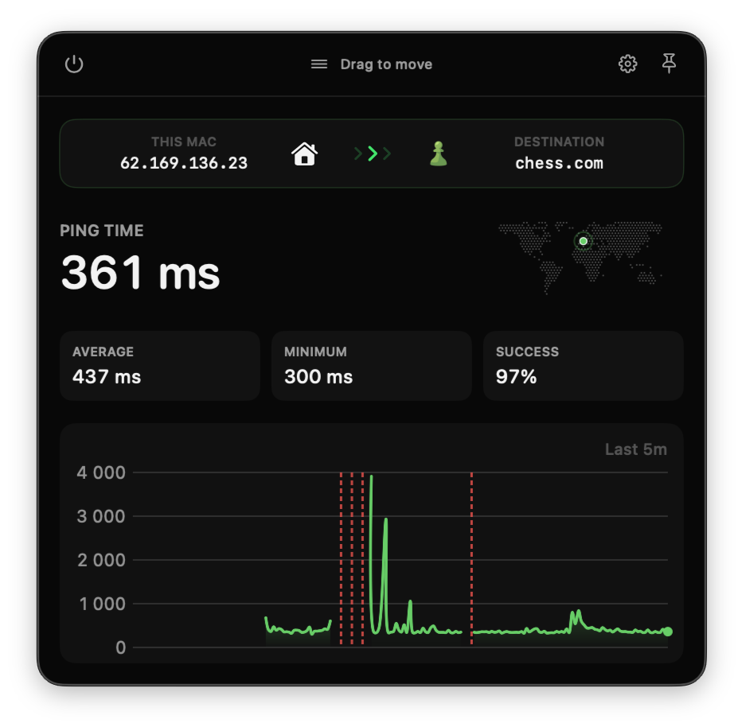
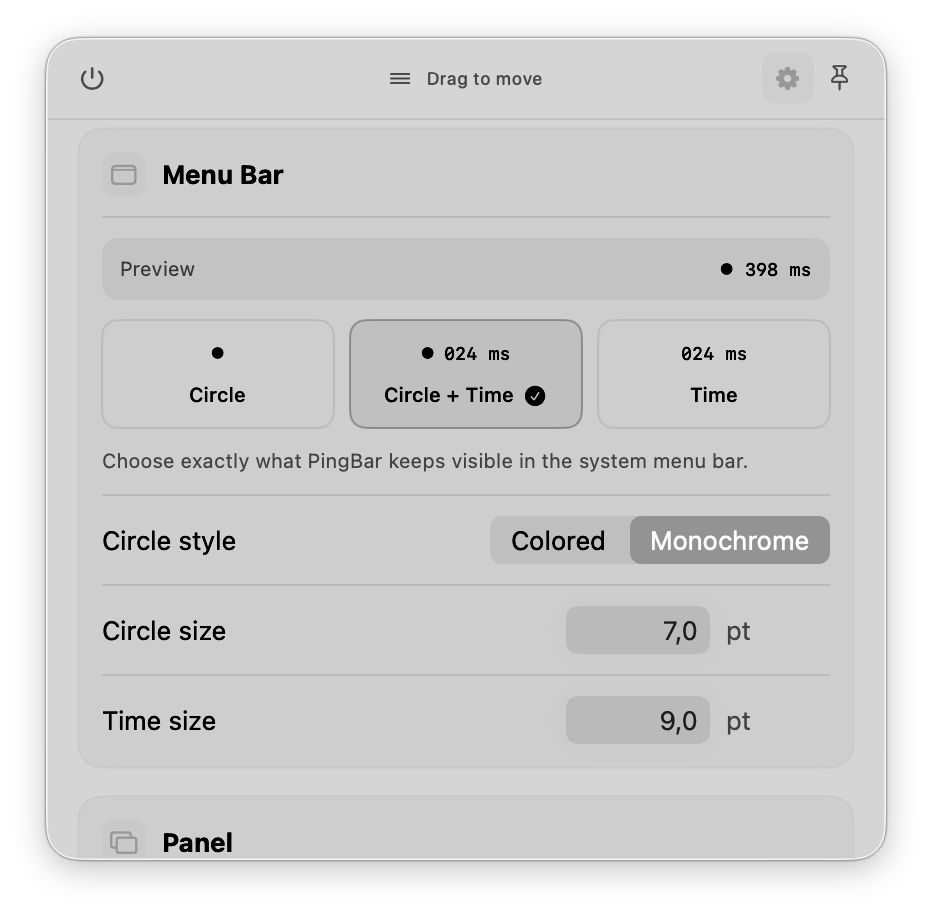
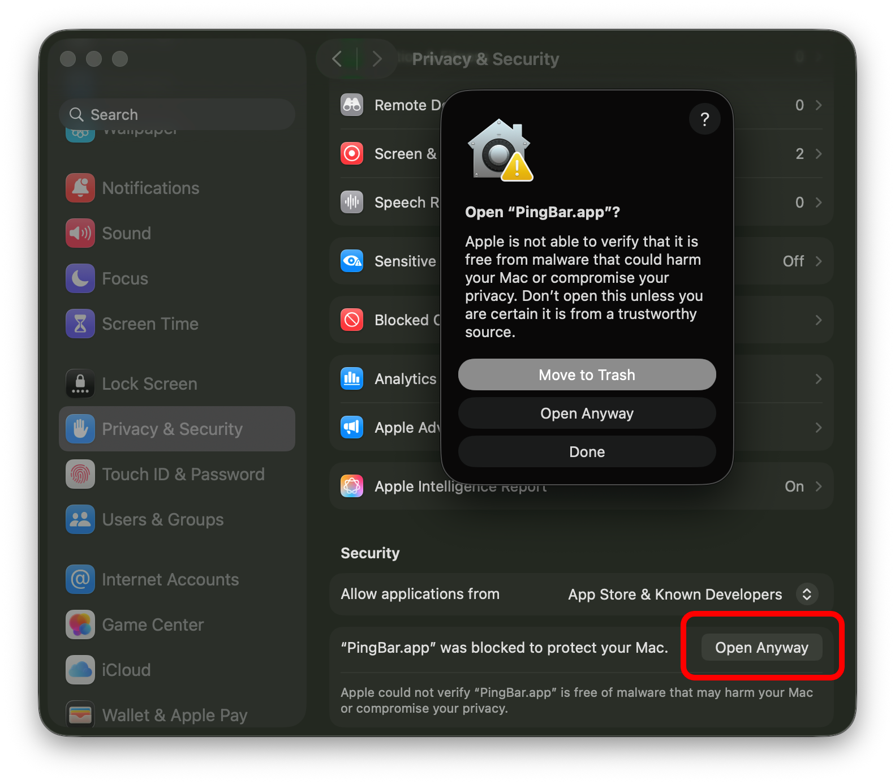

# PingBar

A lightweight, native macOS menu-bar monitor for HTTP availability and latency. PingBar checks an endpoint on a schedule, keeps recent response history, and shows current health without taking space in the Dock.

| Status | Settings |
| --- | --- |
|  |  |

## Features

- Configurable HTTP or HTTPS endpoint, interval, and timeout.
- Green, yellow, and red availability states with configurable failure thresholds.
- Current, average, and minimum latency with recent success rate.
- Live chart with green success segments and red failure markers.
- Menu-bar display modes: circle, circle and time, or time.
- Compact, fixed-width latency values that keep the menu-bar item stable.
- Configurable menu-bar text size, circle size, HTTP success range, and chart window.
- Movable status and settings panel with a shared compact footprint.
- Settings stored locally in macOS `UserDefaults`.

## Requirements

- macOS 14 or newer
- Xcode 26.6 with Swift 6 when building from source

## Install

1. Download `PingBar.zip` from the latest [GitHub Release](../../releases/latest).
2. Unzip it and move `PingBar.app` to `/Applications`.
3. Open PingBar. No build tools are required.

Releases are currently ad-hoc signed rather than notarized, so the first launch may require the steps below.

### macOS cannot verify the app

PingBar is currently ad-hoc signed rather than notarized by Apple, so macOS may show:

> Apple could not verify “PingBar.app” is free of malware that may harm your Mac or compromise your privacy.

Only continue if you downloaded PingBar from this repository's GitHub Releases page.

1. Move `PingBar.app` to the Applications folder.
2. Control-click or right-click `PingBar.app` and choose **Open**.
3. Click **Open** in the confirmation dialog.

If **Open** is not available, try launching the app once, then open **System Settings → Privacy & Security**, scroll to the Security section, and click **Open Anyway** next to the PingBar message.

<details>
<summary>Open Anyway in macOS Privacy and Security settings</summary>


</details>

As a final option for a trusted download, remove only PingBar's quarantine attribute in Terminal:

```sh
xattr -dr com.apple.quarantine /Applications/PingBar.app
open /Applications/PingBar.app
```

## Use PingBar

Click the PingBar item in the macOS menu bar to view current latency, recent statistics, availability history, and the last check time.

- Click **Check Now** to run an immediate request.
- Click **Settings** to configure the endpoint, timing, status thresholds, chart, and menu-bar appearance.
- Drag the strip at the top of either page to move the panel.
- Use **Circle**, **Circle + Time**, or **Time** to control the menu-bar display.

Menu-bar latency is rounded and kept to six monospaced characters so its reserved width does not change. Milliseconds appear as values such as `024 ms`; latencies of one second or more appear as values such as `1.24 s` or `12.3 s`.

### Status colors

| Color | Meaning |
| --- | --- |
| Green | The endpoint is healthy, or has not yet reached the warning threshold. |
| Yellow | Consecutive failures reached the configured warning threshold. |
| Red | Consecutive failures reached the configured failure threshold. |

A successful request resets the consecutive-failure counter. Responses outside the configured inclusive HTTP status range count as failures.

## Develop

### Build the app

```sh
./scripts/build-app.sh
open PingBar.app
```

This creates an ad-hoc signed `PingBar.app` in the project directory.

The app icon is generated from `logo.svg` and `Resources/AppIcon.svg`. With ImageMagick installed, regenerate it using `./scripts/build-icon.sh`.

### Run from source

```sh
xcrun swift run PingBar
```

### Test

```sh
xcrun swift test
```

GitHub Actions runs the tests and uploads a packaged `PingBar.app` artifact for every push to `main` and every pull request.

Pushing a version tag such as `v1.1.0` builds and publishes the ready-to-run `PingBar.zip` on GitHub Releases.
